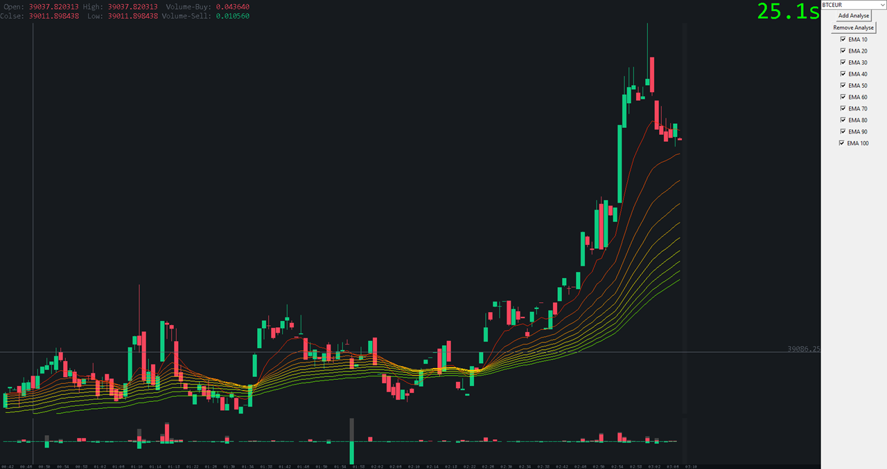

# Projekt inżynierski

# Time Series Analysis of Cryptocurrency Rates

## App view

## Indicators
 - SMA
 - EMA
 - WMA
 - VWAP
 - TRIX
 - MACD
 - RSI
 - MFI
 - KDJ
 - StochRSI
 - CNN (neural network to predict price increase or decrease)

## CNN Indicator
There are three separate networks, each dedicated to predicting BTCEUR, ETHEUR, and LTCEUR price increase or decrease.
The most effective models were selected from a range of architectures, including Fully Connected (FC), Long Short-Term Memory (LSTM), and Convolutional Neural Networks (CNN).
The chosen models are based on Convolutional Neural Networks (CNNs) because they had the best results.
The input data is an 8 minute interval with 93 features.

## Languages and Libraries Used
 - Python
   - Tkinter
   - Numpy
   - Pandas
   - TensorFlow
 - C
   - OpenGL

## Requirements
 - Python - 3.8
 - CUDA - 10.1
 - cuDNN - 7.6.0
 - tensorflow-gpu - 2.2.0
 - numpy - 1.18.5
 - pandas - 1.1.2
 - aiohttp - 3.9.1

## C Libraries
 - GraphDrawing DLL
   - The library was developed to accelerate graph rendering becaue Tkinter was performing too slowly.
 - Indicators DLL
   - The library was developed to accelerate the calculation of indicators required for the input data to the neural network.

## Run
 - `python main.py`

## Compile DLLs
 - GraphDrawer
   - `gcc -shared -o GraphDrawer/opengl_drawer.dll GraphDrawer/opengl_drawer.c -lopengl32 -lgdi32`
 - Indicators
   - `gcc -shared -o Analyzers/indicators.dll Analyzers/indicators.c`
